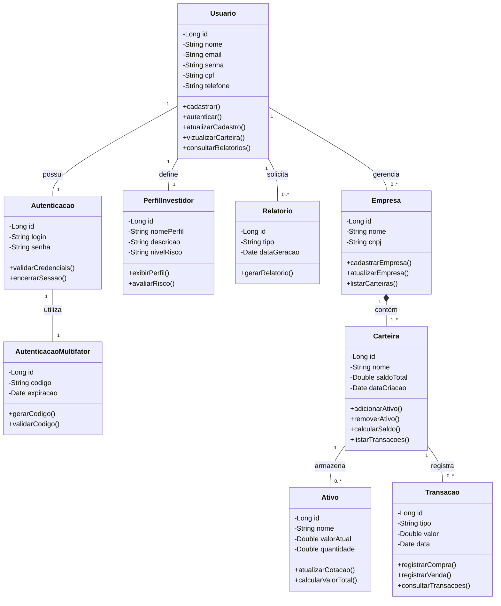

```mermaid
classDiagram
    class Usuario {
        -Long id
        -String nome
        -String email
        -String senha
        -String cpf
        -String telefone
        +cadastrar()
        +autenticar()
        +atualizarCadastro()
        +vizualizarCarteira()
        +consultarRelatorios()
    }

    class Autenticacao {
        -Long id
        -String login
        -String senha
        +validarCredenciais()
        +encerrarSessao()
    }

    class AutenticacaoMultifator {
        -Long id
        -String codigo
        -Date expiracao
        +gerarCodigo()
        +validarCodigo()
    }

    class PerfilInvestidor {
        -Long id
        -String nomePerfil
        -String descricao
        -String nivelRisco
        +exibirPerfil()
        +avaliarRisco()
    }

    class Relatorio {
        -Long id
        -String tipo
        -Date dataGeracao
        +gerarRelatorio()
    }

    class Empresa {
        -Long id
        -String nome
        -String cnpj
        +cadastrarEmpresa()
        +atualizarEmpresa()
        +listarCarteiras()
    }

    class Carteira {
        -Long id
        -String nome
        -Double saldoTotal
        -Date dataCriacao
        +adicionarAtivo()
        +removerAtivo()
        +calcularSaldo()
        +listarTransacoes()
    }

    class Ativo {
        -Long id
        -String nome
        -Double valorAtual
        -Double quantidade
        +atualizarCotacao()
        +calcularValorTotal()
    }

    class Transacao {
        -Long id
        -String tipo
        -Double valor
        -Date data
        +registrarCompra()
        +registrarVenda()
        +consultarTransacoes()
    }

    %% Relacionamentos e Multiplicidade
    Usuario "1" -- "1" Autenticacao : possui
    Autenticacao "1" -- "1" AutenticacaoMultifator : utiliza
    Usuario "1" -- "1" PerfilInvestidor : define
    Usuario "1" -- "0..*" Relatorio : solicita
    Usuario "1" -- "0..*" Empresa : gerencia
    Empresa "1" *-- "1..*" Carteira : contém
    Carteira "1" -- "0..*" Ativo : armazena
    Carteira "1" -- "0..*" Transacao : registra
```